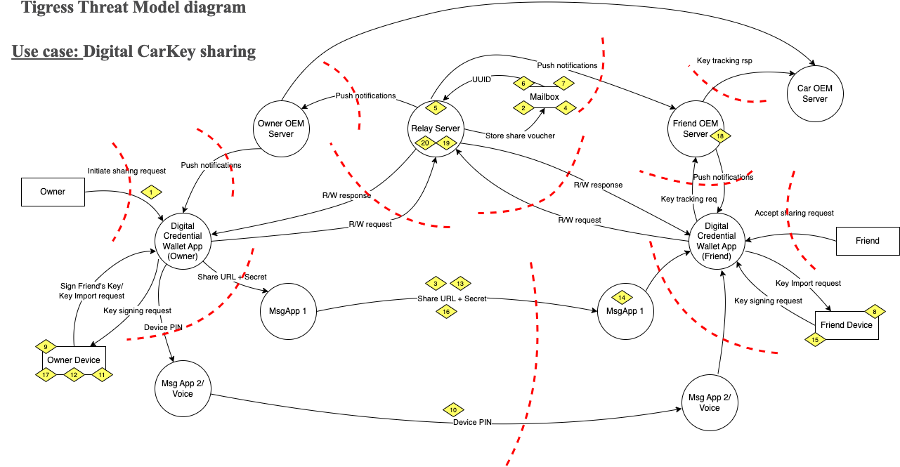

---

title: "Transfer Digital Credentials Securely: sample implementation and threat model"
abbrev: "tigress-sample-implementation"
category: info

docname: draft-tigress-sample-implementation-latest
submissiontype: IETF
number:
date:
consensus: true
v: 3
area: ART
workgroup: Tigress
keyword: Internet-Draft
venue:
#  group: WG
#  type: Working Group
#  mail: tigress@ietf.org
#  arch: "https://mailarchive.ietf.org/arch/browse/tigress"
  github: "dimmyvi/tigress-sample-implementation"
  latest: "https://github.com/dimmyvi/tigress-sample-implementation"

author:
 -
    ins: D. Vinokurov
    fullname: Dmitry Vinokurov
    organization: Apple Inc
    email: dvinokurov@apple.com
 -
    ins: A. Bulgakov
    name: Alexey Bulgakov
    organization: Apple Inc
    email: abulgakov@apple.com
 -
    ins: J.L. Giraud
    name: Jean-Luc Giraud
    organization: Apple Inc
    email: jgiraud@apple.com
 -
    ins: C. Astiz
    name: Casey Astiz
    organization: Apple Inc
    email: castiz@apple.com
 -
    ins: A. Pelletier
    name: Alex Pelletier
    organization: Apple Inc
    email: a_pelletier@apple.com

normative:
  Tigress-00:
    author:
    -
      ins: D. Vinokurov
      name: Dmitry Vinokurov
    -
      ins: M. Byington
      name: Matt Byington
    -
      ins: M. Lerch
      name: Matthias Lerch
    -
      ins: A. Pelletier
      name: Alex Pelletier
    -
      ins: N. Sha
      name: Nick Sha
    title: "Transfer Digital Credentials Securely"
    date: 2022-09
    target: https://datatracker.ietf.org/doc/draft-art-tigress/

informative:

--- abstract

This document describes a sample implementation and its threat model of the secure transfer of digital credentials (Tigress) solution of the corresponding Tigress Internet-draft {{Tigress-00}}.

--- middle

# Introduction

This document provides a sample implementation and threat model for it.

# Conventions and Definitions

{::boilerplate bcp14-tagged}

# Sample Implementation - Digital CarKey sharing example.

- An owner device (Sender) starts sharing flow with selection of credential entitlements for the key shared - e.g. access entitlements (allow open the car, allow start the engine, allow to drive the car), time of sharing - e.g. from 09/01/2022 to 09/03/2022, then generates a KeyCreationRequest (per CCC spec). 

- The owner device generates a new symmetric encryption key (Secret) and encrypts the data. Then generates an attestation blob, that follows a WebAuthn API, specific to Apple - AAA (Apple Anonymous Attestation), which covers the encrypted content. Owner device makes a call to Relay server (Intermediary) - createMailbox, passing over the encrypted content, device attestation, mailbox configuration (mailbox time-to-live, access rights - RWD), preview (display information) details, it’s push notification token and a unique deviceClaim.

- Relay server verifies device attestation using WebAuthn verification rules specific to AAA, including verifying device PKI certificate in attestation blob. Relay server creates a mailbox, using mailboxConfiguration received in the request and stores encrypted content in it. 
- The mailbox has a time-to-live, time, when it is to expire and be deleted by the Relay server. This time is limited by the value that can be considered both sufficient to complete the transfer and secure to against brute force attacks on the encrypted content the content - e.g. 48 hours. 

- Relay server generates a unique mailboxIdentifier value, that is hard to predict - e.g. using GUID - and builds a full URL (shareURL) referencing the mailbox - e.g. www.example.com/v1/m/2bba630e-519b-11ec-bf63-0242ac130002 (http://www.example.com/v1/m/), which it returns to the Owner device.

- Owner device locally stores the shareURL and the Secret and sends the shareURL with optional vertical in URL parameter and mandatory secret in Fragment part (e.g. www.example.com/v1/m/2bba630e-519b-11ec-bf63-0242ac130002 (http://www.example.com/v1/m/)?v=c#hXlr6aRC7KgJpOLTNZaLsw==) to the Friend’s device (Receiver) over SMS.

- Friend device receives the shareURL in SMS, messaging application makes an automatic GET call to shareURL (excluding Fragment part - Secret) - and fetches a preview (Display Information) html page with OpenGraph tags in the head:

~~~
<html prefix="og: https://ogp.me/ns#">
<head>
 <title>Shared Key</title>
 <meta content="Shared Key" property="og:title"/>
 <meta content="You've been invited to add a shared digital car key to your device." property="og:description"/>
 <meta content="https://example.com/displayInfo/general.png" property="og:url"/>
 <meta content="https://example.com/displayInfo/general.png" property="og:image"/>
 <meta content="200" property="og:image:width"/>
 <meta content="100" property="og:image:height"/>
</head>
</html>
~~~
{: #opengraph-preview title="OpenGraph preview of a credential"}

- Messaging application shows the user a preview of the carKey that Owner wants to share with them. User accepts the shareURL by clicking on the preview in the messaging application. Messaging application redirects the user to wallet (credential manager application) using a deep link mechanism embedded into the OS. 

- Wallet receives the shareURL with the Secret in the Fragment. Friend device checks if the Relay server is in allow-list of accepted Relay servers.

- Wallet reads secure content from the mailbox using shareURL (without the Fragment part) with HTTP POST method, passing a unique deviceClaim with the request. Relay server binds the mailbox (identified by mailboxIdentifier) with the Owner device (with Owner device deviceClaim) and the Friend device (with Friend device deviceClaim). Now only these 2 devices are allowed to read and write secure content to this particular mailbox. This secures the message exchange and prevents other devices from altering the exchange between Owner and Friend.

- Friend’s device decrypts secure content using Secret and extracts KeyCreationRequest (ref to CCC specification). 

- Friend device generates a KeySigningRequest (ref to CCC specification), encrypts it with Secret and uploads to the mailbox with UpdateMailbox call to Relay server, providing its unique deviceClaim and push notification token. 

- Relay server sends a push notification to Owner’s device via Push Notification Server.

-  Owner device, having received a push notification message,  reads secure content from the mailbox using shareURL with HTTP POST method, passing its unique deviceClaim with the request. Owner device decrypts secure content using Secret and extracts KeySigningRequest (ref to CCC specification). 

-  Owner device signs the Friend’s device public key with Owner’s private key and creates a KeyImportRequest (ref to CCC specification). Owner device encrypts it with the Secret and uploads to the mailbox with with UpdateMailbox call to Relay server, providing its unique deviceClaim. 

-  Relay server sends a push notification to Friend device via Push Notification Server. 

- Friend device, having received a push notification message,  reads secure content from the mailbox using shareURL with HTTP POST method, passing its unique deviceClaim with the request. Friend device decrypts secure content using Secret and extracts KeyImportRequest (ref to CCC specification). Friend device provisions the new credential to the wallet and deletes the mailbox with DeleteMailbox call to the Relay server. As an additional security measure, Friend device asks for a verification code (PIN code) generated by Owner device and communicated to Friend out-of-band. 

# Threat Model

{:height="1950px" width="3880px"}

# Security Considerations

TODO Security

# IANA Considerations

This document has no IANA actions.

--- back

# Acknowledgments
{:numbered="false"}

TODO acknowledge.
